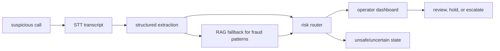
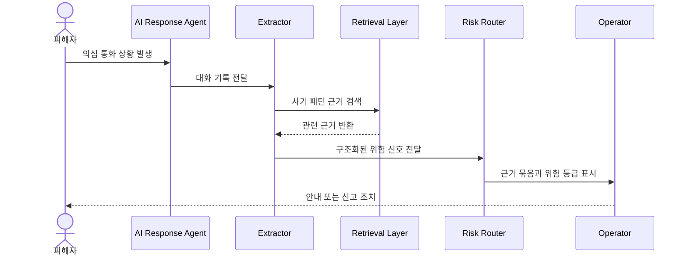

# Sentinel-30 Learning Guide

## 1. 문제 정의

보이스피싱 상황에서 피해자가 즉시 대응하기 어렵다는 문제를 AI 응답, 정보 추출, 위험 라우팅, 운영자 검토 흐름으로 구조화한 보안 AI 기획 프로젝트입니다.

## 2. 프로젝트 유형

- 유형: AI 보안 기획 + RAG/추출 파이프라인 + 운영자 워크플로
- 핵심 역량: AI 시스템 구조화, 보안 시나리오 설계, 증거 기반 의사결정, 시각 자료 커뮤니케이션

## 3. 프로젝트 맞춤형 상호작용 구조 시각화

### 상호작용 표

| 트리거/행동 | 입력/상태 | 처리 컴포넌트 | 데이터/모델/외부 접점 | 출력/산출물 | 검증 신호 | 실패/예외 처리 |
|---|---|---|---|---|---|---|
| 의심 전화 발생 | 음성/대화 상황 | STT intake concept | call transcript | 텍스트 대화 기록 | transcript completeness | 동의/녹취 범위 제한 |
| AI 응답 생성 | scammer utterance, policy | TTS/response agent concept | safety prompt, scenario rules | 지연/확인용 응답 | unsafe response 차단 | 고위험 발화 시 인간 개입 |
| 정보 추출 | transcript | extraction module | entity/risk schema | 계좌, 기관명, 금액, 시간 등 구조화 정보 | schema pass rate | 누락 필드 unknown 처리 |
| RAG fallback | 부족한 맥락 | retrieval module | fraud pattern docs | 참고 근거 | top-k recall, source attached | 근거 부족 시 답변 보류 |
| 위험 라우팅 | extracted evidence | risk router | rule/policy layer | operator alert, dashboard state | risk reason visible | false positive review |
| 운영자 검토 | alert packet | operator workflow | evidence bundle | 조치 판단 | audit trail | privacy/legal escalation |

### AI 보안 처리 흐름



### 운영자 검토 시퀀스



## 4. 아키텍처

- 기획 문서: 문제, 대상자, 대응 흐름, 안전 범위를 설명합니다.
- `images/`: 아키텍처, module map, dashboard, ROI, risk matrix 같은 시각 자료입니다.
- `gen_images_*.py`: 발표용 이미지와 다이어그램 생성 스크립트입니다.
- PDF slide deck: 이해관계자에게 전달하는 결과물입니다.

## 5. 데이터 흐름

```text
call/audio scenario -> transcript -> structured extraction -> fraud-pattern retrieval -> risk routing -> operator evidence packet
```

## 6. 핵심 파일 해부 순서

1. `기획서_Sentinel30_lean.md`: 문제와 핵심 흐름을 빠르게 파악합니다.
2. `기획서_Sentinel30.md`: 전체 서비스 기획과 안전 경계를 봅니다.
3. `images/00_module_map.png` 또는 `images/01_architecture.png`: 모듈 관계를 시각적으로 확인합니다.
4. `gen_images_v3.py`: 시각 자료가 어떻게 생성됐는지 봅니다.

## 7. 설계 이유와 대안

- 기획/시각화 중심으로 둔 이유: 보이스피싱 대응은 법적, 개인정보, 운영 리스크가 크므로 실제 자동화보다 안전한 시스템 설계가 먼저입니다.
- RAG fallback을 둔 이유: 모델이 임의로 답하기보다 사기 패턴 근거를 검색하도록 하기 위해서입니다.
- 운영자 검토를 둔 이유: 고위험 보안 영역에서 AI 단독 조치를 피하기 위해서입니다.

## 8. 테스트/검증

- 발표 자료와 module map이 문제 -> 처리 -> 검토 흐름을 설명하는지 확인합니다.
- 추출 schema, retrieval quality, unsafe response 차단 기준을 향후 구현 검증 항목으로 둡니다.

## 9. 취약점/개선점

- 현재는 기획/데모 산출물 중심이며 실행 가능한 STT/TTS/RAG 서비스는 별도 구현이 필요합니다.
- 개인정보 처리, 녹취 동의, 신고 연계는 실제 서비스 전 법적 검토가 필요합니다.
- extraction schema pass rate와 retrieval top-k recall 평가를 붙이면 AI 평가 포트폴리오로 강해집니다.

## 10. 직접 해볼 변형 과제

1. 사기 대화 transcript 예시 3개를 만들고 추출 schema를 설계합니다.
2. RAG 평가 지표로 top-k recall과 faithfulness를 README에 추가합니다.
3. 운영자 dashboard에서 반드시 보여야 할 필드 5개를 정의합니다.

## 11. 면접 대비

### 30초 설명

Sentinel-30은 보이스피싱 통화를 AI가 단독 해결하는 서비스가 아니라, 통화 기록을 구조화하고 사기 패턴 근거를 검색해 운영자 검토로 연결하는 AI 보안 워크플로 기획 프로젝트입니다.

### 2분 설명

이 프로젝트는 고위험 보안 영역에서 AI를 어떻게 안전하게 사용할지 보여주기 위해 만들었습니다. 의심 통화가 발생하면 STT transcript를 만들고, 추출 모듈이 계좌, 기관명, 금액, 시간 같은 위험 신호를 구조화합니다. 부족한 맥락은 RAG fallback으로 사기 패턴 근거를 검색하고, risk router가 운영자 dashboard에 근거 묶음과 위험 등급을 전달합니다. 핵심은 AI 자동 대응보다 증거, 검토, 개인정보, 법적 경계를 포함한 시스템 설계입니다.
