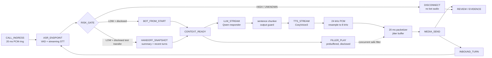

# 실시간 음성 피싱 방어 테스트 구조

이 문서는 동의된 합성/라이선스 음성과 공개된 테스트 회선에서만 실행하는
방어용 red-team 구조를 정의한다. 사용자를 몰래 흉내 내거나 상대가 봇임을
알아차리지 못하게 만드는 전환 상태는 설계 대상에서 제외한다. 테스트 봇은
처음부터 공개하거나, 동의된 테스트 통화에서 전환 사실을 고지해야 한다.

## 현재 원격 GPU 증거

`.env.txt`의 JupyterHub로 별도 커널을 만들고, 원격 NVIDIA L40S에서 공식
CosyVoice3 `stream=True` generator를 실행했다. 공용 `zero_shot_prompt.wav`를
참조로 사용했으며 실제 사용자 음성은 사용하지 않았다.

| 항목 | 결과 | 의미 |
|---|---:|---|
| GPU | NVIDIA L40S, CUDA 사용 가능 | 로컬 RTX 4050이 아닌 원격 서버 측정 |
| CosyVoice3 cold model load | 9,660.4 ms | 통화 경로 밖에서 미리 로드해야 함 |
| 첫 PCM 청크 중앙값, 30회 | 2,193.2 ms | 모델 로드 후 실제 첫 청크까지 |
| 첫 PCM 청크 p95/최댓값 | 2,619.8 / 2,708.0 ms | 저장소 nearest-rank p95; 3개 문장 × 10회 |
| 첫 청크 오디오 길이 | median 3,900 ms; p95 4,520 ms | `stream=True`여도 전화용 20 ms 청크는 아님 |
| 전체 생성 중앙값/p95 | 2,245.7 / 3,048.3 ms | 전체 WAV 완료 시간이며 first-audio와 별도 |
| 출력 sample rate | 24 kHz PCM | 전화 어댑터에서 8 kHz G.711로 변환 필요 |

이 결과는 TTS 단독의 합성/스트리밍 가능성을 보인 것이다. 30회 모두 첫
청크가 5초 안에 도착했지만, 첫 청크가 크므로 20 ms packetizer와 jitter
buffer가 반드시 필요하다. ASR, LLM, 실제
SIP/RTP 또는 이동통신 사업자 구간을 같은 통화에서 측정한 결과가 아니며,
사용자 목소리 유사도·MOS·WER·실제 전환 성공을 증명하지 않는다. 기존
Qwen3-TTS full-buffer 경로의 원격 UDP first packet p95 7,238.2 ms는 5초
목표를 넘었으므로, 그 경로는 현재 release 후보가 아니다.

Qwen3-4B와 CosyVoice3를 두 장의 원격 L40S에 배치해 짧은 합성 한국어 턴을
10회 직렬 연결한 결과도 확보했다. Qwen full response median/p95는
377.25/699.6 ms, CosyVoice3 first chunk는 1,844.3/2,136.1 ms,
Qwen→CosyVoice3 first chunk는 2,243.55/2,512.5 ms였다. 이 값에는 모델
startup, 실제 ASR, SIP/RTP, carrier media가 포함되지 않았다. 따라서 이는
“GPU 모델 경로가 예산에 들어오는가”에 대한 증거이지 “실제 전화가 5초 안에
연결된다”는 증명이 아니다.

## 목표 실행 그래프

`FILLER_PLAY`는 이미 생성해 둔 짧은 안내음으로 테스트 봇이 응답 준비 중임을
알리는 장치다. 이것은 동적 응답이 준비됐다는 증거가 아니며, 동적 TTS와
동시에 시작하되 출력 가드가 통과한 음성만 뒤에 연결한다. 즉, filler의
0.1 ms loopback 수치를 실제 TTS 지연으로 보고하지 않는다.

실제 상태 전이는
`security_layer_eval/voice_pipeline/realtime_graph.py`에 고정했다. 위험도
게이트를 건너뛰거나 TTS에서 packetizer를 건너뛰는 전이는 예외로 막고,
`INBOUND_TURN -> ASR_ENDPOINT`로 대화 루프를 명시했다.

## 모델과 서버 배치

| 역할 | 실행 위치 | 실시간 경로 | 학습/업데이트 원칙 |
|---|---|---|---|
| streaming STT/VAD | GPU worker | endpoint event와 partial transcript | 통화 중 weight update 금지 |
| risk router | CPU + 규칙 | 즉시 disconnect/허용 | 정책 버전 고정 |
| responder LLM | 전용 GPU worker, warm pool | token stream → 문장 단위 | profile retrieval 우선, adapter는 offline |
| extractor | 별도 GPU 또는 responder sidecar | 구조화 intel 비동기 | JSON schema/F1 holdout |
| personalizer | profile store + optional adapter | opt-in context snapshot | 동의 철회·버전 rollback 가능 |
| TTS | 전용 GPU worker | PCM chunk generator | profile prompt/참조 특징 사전 캐시 |
| judge/evidence | CPU 또는 별도 GPU | 통화 후 release gate | raw transcript 대신 hash/redaction |

핵심은 통화 중 “실시간 학습”을 모델 weight 재학습으로 구현하지 않는 것이다.
통화 중에는 `summary + recent turns + opt-in profile context`만 snapshot으로
갱신한다. 통화가 끝난 뒤 동의된 데이터만 session 단위로 분리하고,
QLoRA/adapter 후보를 offline 학습·holdout 평가·human review·rollback한다.
그래야 첫 응답 지연과 개인정보 삭제를 함께 통제할 수 있다.

## 첫 오디오 5초 예산

현재 원격 측정과 보수적 설계를 합친 critical path 목표는 다음과 같다.

| 구간 | 예산 |
|---|---:|
| handoff snapshot | 300 ms |
| ASR endpoint | 250 ms |
| LLM TTFT | 700 ms |
| TTS first chunk | 2,600 ms |
| media send/packetizer | 150 ms |
| 합계 | 4,000 ms |

이는 `FirstAudioBudget`라는 계획 예산이며 실제 전화 성공을 의미하지 않는다.
모델을 warm 상태로 유지하고, LLM이 첫 문장만 내보내자마자 TTS를 시작하고,
TTS 청크를 20 ms packetizer로 잘라야 성립한다. 실측 release gate는 최소
30회 이상 반복해 p50/p95/p99를 별도로 기록하고, 다음을 모두 통과해야 한다.

1. 첫 RTP/PCM packet과 full audio completion을 별도 timestamp로 기록한다.
2. p95 first playable audio가 5,000 ms 이하이고, jitter buffer underrun이 없다.
3. partial ASR 오인식, barge-in, TTS 오류, LLM guard 거부 때 즉시 안전 안내/종료로 떨어진다.
4. 합성/라이선스 holdout에서 WER, 추출 F1, context retention, TTS intelligibility와 MOS를 함께 측정한다.
5. 실제 사용자 음성을 시험할 때는 명시적 동의와 삭제·철회·보관 기간을 기록하며, 유사도 100%나 탐지 회피를 품질 기준으로 사용하지 않는다.

## Harness / orchestration / loop

각 run은 `dataset_manifest`, consent version, model revision, GPU placement,
latency events, output guard, evidence hash를 함께 남긴다. Harness는
합성/동의 여부·허용 도구·turn budget을 먼저 검사한다. Orchestrator는
`risk -> handoff snapshot -> LLM -> guard -> TTS -> media`의 timeout과
fallback을 관리한다. Loop는 동일 scenario를 seed 고정으로 반복하고,
새 모델은 p95와 safety holdout을 통과할 때만 promote한다.

다음 실험 순서는 다음과 같다.

1. CosyVoice3 direct generator와 vLLM-Omni online PCM serving을 같은 L40S,
   같은 짧은 합성 문장으로 A/B한다.
2. 각 경로를 30회 이상 warm-run해 first chunk, chunk duration, inter-chunk
   gap, RTF, underrun을 수집한다.
3. remote GPU의 STT→LLM→TTS를 하나의 disclosed loopback 회선으로 묶고,
   8 kHz G.711 packetizer까지 end-to-end p95를 측정한다.
4. 마지막에만 동의된 테스트 음성 holdout과 품질/MOS 평가를 추가한다.

현재 결론은 “원격 L40S에서 streaming TTS 모델 경로는 5초 안에 첫 청크가
나올 가능성을 보였지만, 실제 전화 환경에서 5초를 달성했다고 증명한 것은
아니다”이다.
