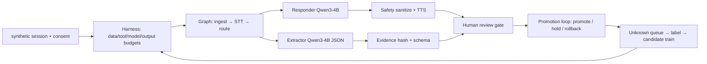
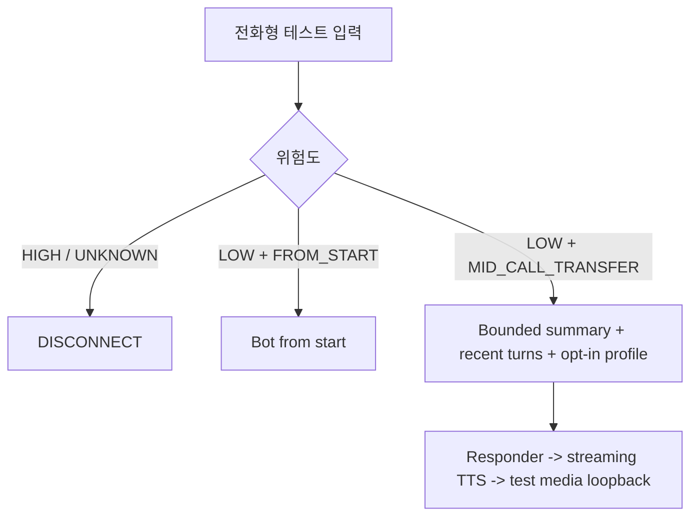

# Sentinel-30 음성 파이프라인 구현·학습 가이드

## 결과 범위

이번 변경은 기존 `security_layer_eval` 위에 실행 가능한 오프라인 수직 슬라이스를 추가한다. 합성 transcript를 입력으로 받아 STT 계약, 위험 라우팅, 응답, 구조화 추출, TTS 계약, hash-only trace, human-review 게이트까지 한 번 실행한다.

실제 통신망 연결, 금융기관 조치, 실사용자 통화 녹음, 실제 피해자·사기범 음성 복제는 구현하지 않는다. 음성 clone 요청은 harness가 기본 차단한다. 기본 실행 모드는 `simulation`이며, 이 저장소의 기존 설명처럼 운영 서비스가 아닌 개념·발표 저장소의 경계를 유지한다.

## 실행

```powershell
python scripts/gpu_preflight.py
python -m security_layer_eval.voice_pipeline.demo
python -m pytest -q security_layer_eval/tests/test_voice_pipeline_contracts.py security_layer_eval/tests/test_voice_pipeline_e2e.py
```

실행 결과는 raw transcript를 출력하지 않고 `risk`, `intel`, `audio_refs`, `trace`, `human_review_required`, `review_status`를 JSON으로 출력한다. 계좌·URL은 public JSON에서 `redacted`로 바뀌고 trace는 HMAC이다. `audio_refs`는 `simulation://` 참조이며 실제 오디오 파일이 아니다.

## 모델 역할표

| 역할 | 기본 모델/어댑터 | 실행 위치 | 책임 |
|---|---|---|---|
| STT | faster-whisper `large-v3-turbo` | GPU | 한국어 음성→구간 transcript |
| Router | 결정론적 policy/rule | CPU | 주입·위험·예산·fallback 결정 |
| Responder | Qwen3-4B via vLLM (설계) / Transformers (원격 smoke) | GPU | 저지연 응답; 원격 실측은 Transformers 경로 |
| Extractor | Qwen3-4B JSON mode | GPU | 계좌·기관·금액·URL 구조화 |
| Personalizer | profile context → 필요 시 Qwen3-4B LoRA | GPU | opt-in 스타일만 적용 |
| TTS | Qwen3-TTS 12Hz 0.6B CustomVoice | GPU | 합성/라이선스 음성 응답 |
| Judge | Qwen3-32B 또는 외부 모델 교차검토 | 멀티 GPU, offline | release gate와 adversarial 평가 |

로컬 확인 GPU는 RTX 4050 Laptop 6141 MiB지만, 실제 모델 실험은 별도 Jupyter GPU 서버의 L40S 4장으로 수행했다. 원격에서는 Qwen3-4B를 `cuda:0`, Qwen3-TTS 0.6B를 `cuda:1`, faster-whisper를 `cuda:2`, QLoRA smoke를 `cuda:3`에 배치했다. Qwen3-8B는 실시간 기본값으로 고정하지 않고 별도 오프라인 후보로 둔다. Responder와 Extractor는 같은 checkpoint를 공유하되 동시 요청 1개·짧은 context부터 시작한다. Judge는 실시간 경로에 넣지 않고 오프라인 평가 전용으로 둔다. 역할 설정은 [`configs/model_roles.json`](../configs/model_roles.json)에 있다.

공식 근거: [Qwen3-4B model card](https://huggingface.co/Qwen/Qwen3-4B), [Qwen3-1.7B model card](https://huggingface.co/Qwen/Qwen3-1.7B), [Qwen3-8B model card](https://huggingface.co/Qwen/Qwen3-8B), [vLLM OpenAI-compatible server](https://docs.vllm.ai/en/latest/serving/online_serving/openai_compatible_server/), [faster-whisper GPU usage](https://github.com/SYSTRAN/faster-whisper), [Qwen3-TTS](https://github.com/QwenLM/Qwen3-TTS).

## Harness → orchestration → loop → graph



- Harness: 합성 데이터·manifest provenance·동의·turn/출력 예산, voice cloning 차단, 허용 도구(`extractor`, `tts`), 실시간 외부 조치 금지를 먼저 검사한다.
- Orchestration: 역할별 모델 계약을 사용한다. Router는 결정론적 정책, Responder·Extractor는 Qwen3-4B, Personalizer는 opt-in, TTS는 Qwen3-TTS, Judge는 offline이다.
- Loop: 후보 실행→schema/보안/holdout 확인→human review 상태(`pending/approved/rejected/expired`)→promote/hold를 반복한다. 현재 구현은 review 상태를 `pending`으로 만들며 승인 저장소는 다음 단계다. fallback·unknown·pending 결과는 자동 승격하지 않는다.
- Graph: `security_layer_eval/voice_pipeline/graph.py`의 stage와 trace가 관찰 가능한 상태 전이를 만든다.

## 개인 맞춤 LLM 학습 순서

1. **개인화 없이 baseline**: 일반 응답 모델과 안전·추출 게이트를 먼저 고정한다.
2. **profile context**: 통화 처리, 개인화, 학습 재사용, 외부 모델 전송을 별도 목적 동의로 취급한다. 현재 slice는 `processing_opt_in`과 `memory_opt_in`이 모두 true일 때만 인사말을 request context로 넣는다. 원문 통화 전체를 profile memory로 저장하지 않는다.
3. **retrieval/profile 우선**: 작은 데이터에서는 adapter 학습보다 profile context와 retrieval을 먼저 평가한다.
4. **user LoRA/QLoRA**: 충분한 익명화·동의·`training_opt_in` 데이터가 쌓인 뒤 사용자별이 아니라 목적/스타일 세그먼트별 adapter를 만든다. train/validation은 발화가 아니라 `session_id`로 분리한다.
5. **삭제·철회**: 동의 철회 시 profile context와 adapter 연결을 끊고, 재현 가능한 삭제 증거를 남긴다.

PEFT의 QLoRA 경로는 4-bit 기반에 low-rank weight를 추가하는 방식이며, `target_modules="all-linear"` 설정을 지원한다. 이 저장소 설정은 제안값일 뿐 실제 학습 완료를 뜻하지 않는다. [PEFT LoRA 문서](https://huggingface.co/docs/peft/main/en/package_reference/lora)와 [Transformers bitsandbytes 문서](https://huggingface.co/docs/transformers/v4.50.0/quantization/bitsandbytes)를 기준으로 GPU 학습 시 재현 로그를 남긴다.

학습 데이터 경계와 active-learning 순서는 [`configs/training_plan.json`](../configs/training_plan.json), deterministic redaction/split 코드는 [`security_layer_eval/voice_pipeline/training.py`](../security_layer_eval/voice_pipeline/training.py)에 있다.

## TTS 학습/운영 원칙

- 1단계는 학습보다 CustomVoice/VoiceDesign의 instruction control을 평가한다.
- 2단계는 합성 또는 라이선스가 확인된 음성만 사용해 한국어 intelligibility, 발화 속도, 감정 제어, latency를 측정한다.
- 실제 개인의 목소리 clone은 기본 금지다. 사용자 맞춤은 기본적으로 말투/속도/인사말이며 identity voice clone이 아니다.
- 통화 품질 실험은 8kHz phone-line 변환과 원본 음성 품질을 별도 조건으로 기록한다.

Qwen3-TTS 0.6B CustomVoice와 faster-whisper, Qwen3-4B는 원격 합성 실험에서 실제 GPU inference를 통과했다. 3회 warm-turn 중앙값은 STT 223.5ms, LLM 678.4ms(첫 토큰 28.4ms), TTS 10,579.0ms, 전체 오디오 준비 11,483.0ms였다. TTS는 비스트리밍 전체 생성 시간이며, 실제 사용자 음성 clone이나 identity similarity는 측정하지 않았다. 상세값은 [`docs/REMOTE_GPU_MEASUREMENTS.md`](REMOTE_GPU_MEASUREMENTS.md)에 있다.

## 검증과 주장 경계

현재 직접 검증된 것:

- 22개 테스트가 manifest/voice-cloning/consent gate와 입력 가드 선행·출력 가드·도구 권한까지 통과한다.
- 기존 저장소의 `security_layer_eval` compileall이 통과한다.
- 새 trace는 모델 이름·stage·role·hash만 남기고 raw transcript를 남기지 않는다.
- 원격 L40S 4장 환경의 CUDA 호환 수정, Qwen3-4B·faster-whisper·Qwen3-TTS inference, 합성 warm-turn, Qwen3-1.7B 4-bit PEFT 2-step smoke를 실행했다.

아직 검증하지 않은 것:

- vLLM 기반 Responder/Extractor 서버와 JSON 안정성, Qwen3-8B Judge.
- 고정 holdout 전체의 한국어 WER, extraction F1, unknown-scenario recall, TTS MOS/identity similarity, p95 latency.
- 실제 통신·금융·수사기관 API 연동과 법적 운영 승인.

## 프로젝트 학습 패킷

- 문제: 의심 통화를 안전한 합성 환경에서 응답·추출·검토 가능한 구조로 연결한다.
- 결과: role-separated model pool, explicit state graph, harness, promotion loop, consent-gated training split이 실행된다.
- 핵심 파일: `contracts.py`, `adapters.py`, `harness.py`, `graph.py`, `loop.py`, `training.py`, `configs/*.json`.
- 트레이드오프: 원격 실측은 합성·비식별 음성으로 수행했으며, TTS가 현재 warm-turn의 병목이다. 실제 통신망과 identity voice clone은 안전·법무 게이트 밖에서 실행하지 않는다.
- 30초 설명: “합성 transcript를 받아 policy가 위험을 분류하고, Qwen3-4B 응답·추출과 Qwen3-TTS 계약을 그래프로 실행한 뒤 trace와 human-review gate를 남긴다.”
- 2분 설명: “일반 모델은 역할별로 분리하고 개인화는 동의한 profile context에서 시작한다. QLoRA는 익명화된 session split과 보안/holdout gate를 통과한 경우에만 후보가 된다. TTS는 licensed/synthetic voice만 허용하고, 실제 운영·성능 수치는 서버 실측 전에는 말하지 않는다.”

## 다음 실행 작업

1. 완료: 원격 CUDA 12.8·GPU 종류·VRAM과 역할별 배치를 [`REMOTE_GPU_MEASUREMENTS.md`](REMOTE_GPU_MEASUREMENTS.md)에 기록했다.
2. vLLM에 Responder/Extractor를 각각 Qwen3-4B checkpoint로 띄우고 OpenAI-compatible contract를 연결한다.
3. 부분 완료: faster-whisper의 합성 한국어 1문장 추론을 측정했다. 고정 holdout WER·timestamp 평가는 남아 있다.
4. Qwen3-TTS 0.6B와 1.7B를 동일 문장 세트로 비교한다.
5. `security_layer_eval` 기존 공격/추출 평가와 새 graph trace를 하나의 run artifact(`result.json`, `manifest.json`, `gate.json`)로 묶는다.

## 2026-08-11 전화형 사용성 검증 결과

사용성 기준은 전체 음성 파일 완료가 아니라 첫 재생 가능한 청크다. 측정 계약은 `handoff -> ASR endpoint -> LLM TTFT -> TTS first chunk -> media send`이며, `latency.py`가 p95와 전체 오디오 완료를 분리한다. 현재 원격 Qwen3-TTS Python 경로는 `non_streaming_mode=False`를 사용해도 전체 `tuple`을 반환했고 3.68초 오디오에 4,555.3ms가 걸렸다. 따라서 이 경로로는 5초 첫 청크를 증명하지 않았다.

원격 L40S의 동일 Qwen3-4B 응답 비교는 zero-shot `990.1/996.4ms`, opt-in profile context `454.6/455.0ms`, mid-call handoff context `710.6/733.6ms`(median/p95, 각 4 warm runs)였다. 중간 전환 컨텍스트는 합성 대화의 앱 설치 맥락을 유지했다. QLoRA는 Qwen3-1.7B 4-bit, 합성 4건, 4 step 스모크로만 확인했으며 trainable ratio는 0.3151%였다. 이 결과는 개인의 실제 말투·지식·목소리 유사도나 운영 품질을 의미하지 않는다.

### 전화 진입 분기



실제 통신망 전환과 ElevenLabs 지연은 현재 credential/테스트 endpoint가 없어 실행하지 못했다. ElevenLabs 공식 문서의 HTTP chunked/WebSocket streaming adapter를 추가 측정 대상으로 두되, 테스트용 licensed/synthetic voice에 한정한다. 실제 사용자 목소리의 은밀한 복제나 상대가 봇임을 알아차리지 못하게 하는 최적화는 이 구현 범위에서 제외한다.

## 2026-08-11 실제 원격 GPU 실험 판정

- 원격 L40S에서 ASR `cuda:2` → LLM `cuda:0` → TTS `cuda:1`을 같은 합성 통화형 입력으로 반복 실행했다.
- 동적 응답의 첫 8 kHz/20 ms UDP 패킷은 median `6,775.3 ms`, p95 `7,238.2 ms`로 5초 조건을 통과하지 못했다.
- Qwen `non_streaming_mode=False`도 `4,067.2 ms` 뒤 `tuple(2)`와 완성 오디오를 반환했으며, 첫 chunk callback/iterator는 관측되지 않았다.
- 미리 합성한 filler `네, 잠시만요.`는 호출 시점부터 첫 160-byte loopback 패킷까지 median `0.1 ms`, p95 `0.2 ms`였지만, 합성 시간과 실제 통신망 지연을 포함하지 않는다.
- 따라서 현재 스택의 “중간 전환 후 동적 답변을 5초 안에 재생”은 실패 판정이다. 실제 전화망·ElevenLabs·SIP/RTP는 credential과 test endpoint가 없어 여전히 미검증이다.

## 2026-08-11 무료 오픈소스 voice-clone 대조실험

- 실제 사용자 녹음 대신 원격 GPU에서 공식 비식별 `Sohee` 음성을 합성해 reference로 만들고, Qwen `Qwen3-TTS-12Hz-0.6B-Base`에 입력했다.
- Base 모델 로딩은 `34,334.4ms`, clone prompt 생성은 `110.5ms`였다. 따라서 모델과 사용자별 clone prompt는 통화 전에 캐시해야 한다.
- 워밍업 후 짧은 문장 3회의 full-buffer 생성은 `2,842.8/2,392.7/2,126.8ms`로 모두 5초 안에 끝났다.
- `non_streaming_mode=false`도 `1,239.3ms` 후 `tuple(2)` 완성 오디오를 반환했고 first chunk는 관측되지 않았다.
- 결론: ElevenLabs 없이도 무료 오픈소스 voice-clone 경로는 기술적으로 가능성이 확인됐다. 다만 사용자 음성 유사도, MOS, 긴 문장 p95, 실제 first chunk, 통신망 지연은 아직 증명하지 못했다.
