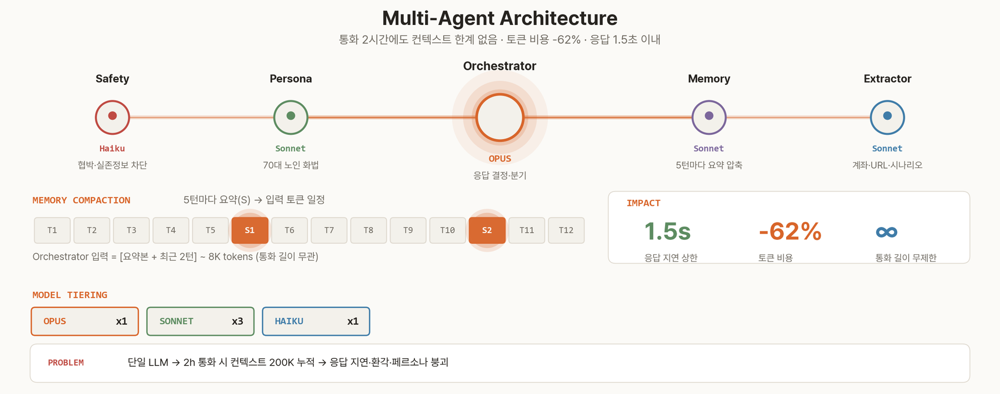
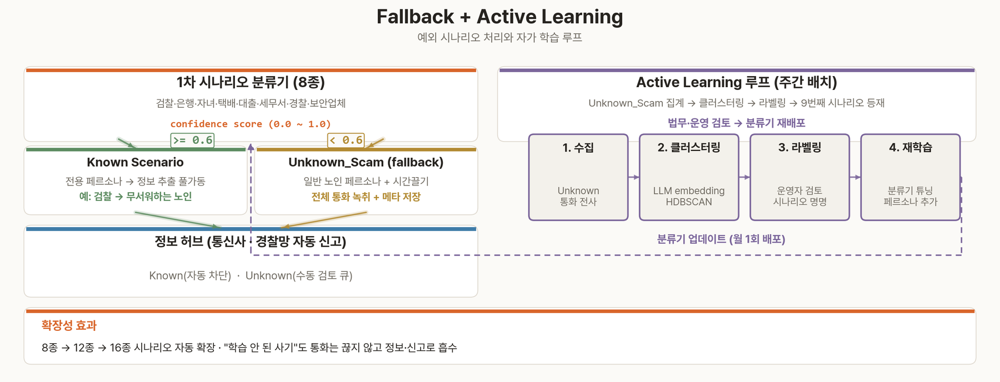
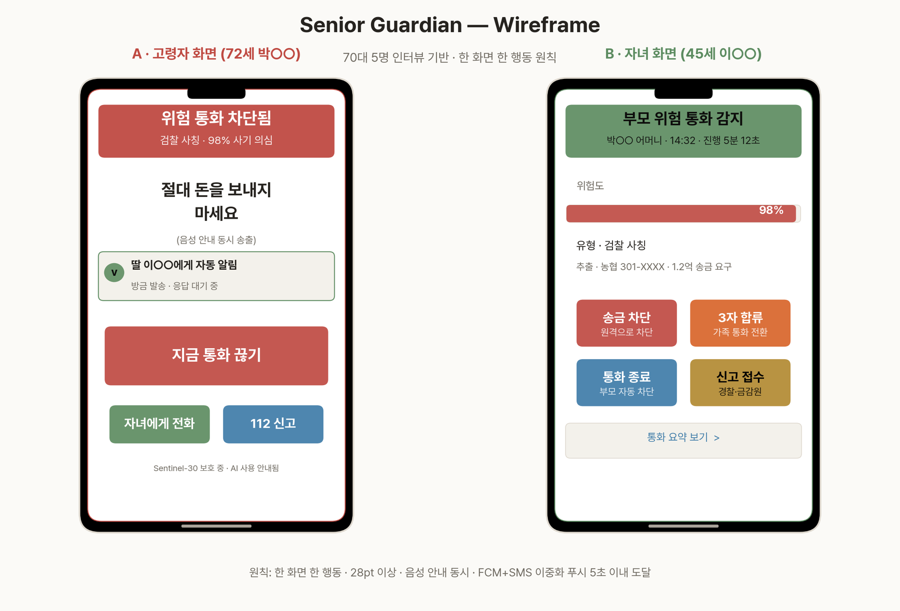
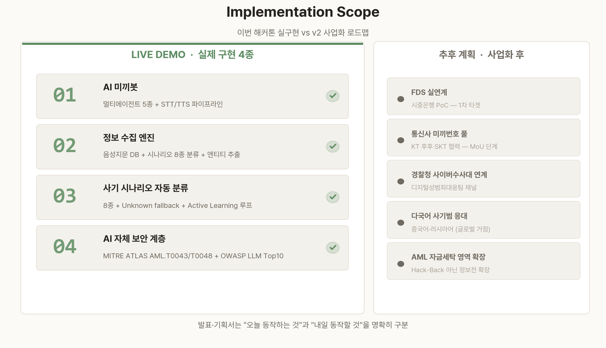
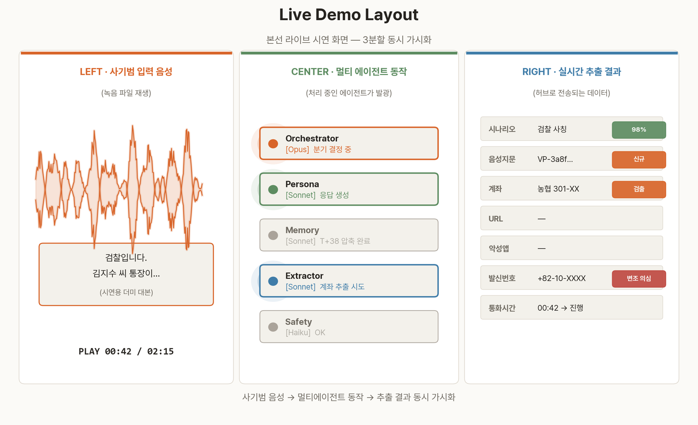
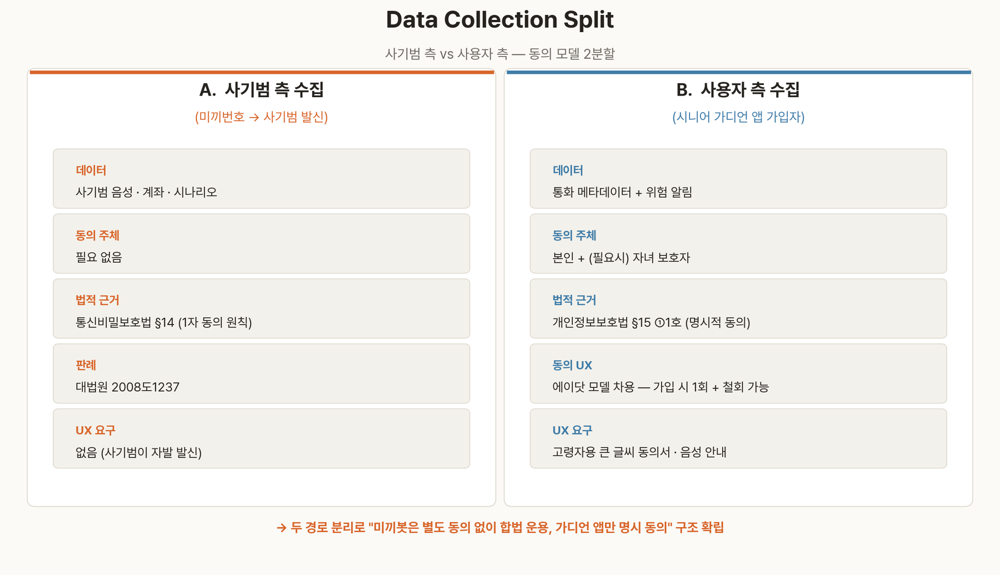

# Sentinel-30
## 보이스피싱 산업의 ROI를 무너뜨리는 AI 능동방어 플랫폼

> "우리는 피해자를 지키지 않는다. 사기범을 망친다."

---

# I. 기획 개요

## 1.1 한 줄 정의

**사기 산업의 시간당 매출을 0으로 만드는 AI 능동방어 플랫폼.** 영국 O2 Daisy AI(2024) 사례를 한국의 금융 워크플로우와 6개 법령 리스크 검토 위에 재설계했다.

## 1.2 프로젝트 정보

| 항목 | 내용 |
|---|---|
| 프로젝트명 | Sentinel-30 |
| 주제 카테고리 | ⑧ AI 기반 보이스피싱 공동 대응 |
| 팀 구성 | 6인 (기획 1 / ML 2 / 백엔드 1 / UX 1 / 법리·보안 1) |
| 진행 단계 | 예선 4주 + 본선 무박 2일 |

## 1.3 예선 평가항목 대응

| 평가항목 | 배점 | Sentinel-30 대응 |
|---|---:|---|
| 문제 적합성 | 25 | AI 민생 10대 프로젝트 ⑧ 보이스피싱 대응. 고령층 피해·환수 골든타임·기관 공동대응을 직접 겨냥한다. |
| AI 기술 활용 | 30 | STT/TTS + 멀티 에이전트 LLM + Unknown fallback + Active Learning + 음성지문 DB. |
| 파급력 및 확장성 | 25 | 예선 모의 라우팅 → 본선 050 보호번호 → 은행·통신사·수사기관 연동으로 확장한다. |
| 아이디어 혁신성 | 20 | 탐지·차단을 넘어 사기범의 시간·정보·도구를 비용으로 전환하는 능동방어 모델. |

## 1.4 기존 솔루션의 한계

- 통신사·핀테크·공공 솔루션 모두 "방어"에만 집중 — **사기범이 치를 비용은 사실상 0**
- 그 결과 사기범 입장에서 잃을 자원이 없으므로 사기 산업은 멈추지 않는다
- Sentinel-30은 **사기범의 시간·정보·도구**라는 자원을 약탈하는 *Active Defense* 모델로 재정의한다

---

# II. 환경분석

## 2.1 시장 압력 — 외부 요인 4종

| 영역 | 동향 | 시사점 |
|---|---|---|
| 정책 | 금감원 「전자금융감독규정」 §31~38 침해사고 대응 강화 (2024 개정) | IR 워크플로우 24시간 자동 신고로 규제 부합 |
| 법제 | AI 기본법 2026.1.22 시행, 생성형 AI 표시·인간 사칭 고지 의무(§50) | 부칙 제2조 1년 계도기간(2027.1.21까지) 활용 시범 운영 + 시행령 미제정 조항에 대해 공공안전 목적 예외 고시 건의 |
| 기술 | 한국어 LLM 고도화 (HyperCLOVA X, EXAONE 3.5), TTS 자연도 향상 | 노인 페르소나 봇 실현 가능성 확보 |
| 국제 | 영국 O2 Daisy AI(2024), Ofcom Voice Scam Action Plan | 한국형 능동방어 운영모델 벤치마크 가능 |

## 2.2 시장 데이터 — 사회적 압박 최고치

| 지표 | 수치 | 출처 |
|---|---|---|
| 국내 보이스피싱 피해액 | **8,545억 원** | 경찰청 2024 (전년 대비 1.9배↑) |
| 발생 건수 | 약 21,000건 | 경찰청 2024 |
| 60대 이상 피해 비중 | 52.3% | 경찰청 2024 |
| 1건당 평균 피해액 | 약 4,100만 원 | 경찰청 2024 (총액÷건수 환산) |
| 피해 환수율 | **25% 미만** | 금융감독원 2024 |
| 글로벌 사기방지 시장 CAGR | 22.8% (2024~2030) | MarketsandMarkets 2024 |

---

# III. 주제 및 아이디어 도출

## 3.1 문제 재정의 — 사기 산업 ROI 파괴

기존 정의 "어떻게 통화를 막을 것인가" → 본 프로젝트는 **"어떻게 사기 산업의 시간당 수익률을 0으로 만들 것인가"** 로 재정의한다.

## 3.2 30분 골든타임 — 시간을 자산화

송금 완료(T+15) ~ 인출 시작(T+30) 사이의 15분이 환수 가능한 골든타임이다. Sentinel-30은 이 구간에 미끼봇 시간 약탈, 정보 허브 수집, 통신사 번호 차단, 경찰망 자동 신고를 병렬로 작동시킨다.

## 3.3 3C 분석

| 구분 | 분석 |
|---|---|
| Company (자사) | 6인 학생팀, 풀스택 구현 한계 있으나 법리·보안 트랙 1명 전담 — 다른 팀에 없는 차별화 자원 |
| Customer (고객) | 1차: 시중은행 디지털보안 부서, 금감원 / 2차: 60대 이상 고령 사용자 + 자녀 |
| Competitor (경쟁) | 통신사 필터·시티즌코난·토스 사기의심사이렌·SKT 에이닷 모두 탐지·차단 중심 — 능동 약탈 영역은 비어 있음 |

## 3.4 SWOT 분석

## 3.5 경쟁사 기능 비교

| 기능 / 항목 | Sentinel-30 (자사) | KT 후후 | SKT 에이닷 | 토스 사이렌 | 시티즌코난 | 더치트 |
|---|---|---|---|---|---|---|
| 사기범 번호 블랙리스트 | ○ | ◎ | ○ | ○ | × | ◎ |
| 통화 실시간 STT 분석 | ○ | ○ | ◎ | × | × | × |
| 사기 시나리오 자동 분류 | ◎ (8종+LLM) | ○ (sLM) | ○ (sLM) | × | × | × |
| 악성앱 탐지 | × | × | × | × | ◎ | × |
| **사기범 시간 약탈 (미끼봇)** | ◎ | × | × | × | × | × |
| **사기범 음성지문 DB** | ◎ | × | × | × | × | × |
| **멀티 에이전트 LLM 구조** | ◎ | × | × | × | × | × |
| 금감원 24시간 자동 신고 | ◎ | × | × | × | × | × |
| 가족 알림 + **송금 거부권** | ◎ (송금 차단) | × | ○ (가족 케어, 알림만) | × | × | × |
| 6개 법령 리스크 검토서 | ◎ | × | × | × | × | × |
| MITRE ATLAS 위협 모델 | ◎ | × | × | × | × | × |

범례: ◎ 핵심 차별화 / ○ 지원 / △ 부분 지원 / × 미지원

→ 경쟁사가 모두 "탐지·차단" 수동 방어에 머무는 동안, Sentinel-30은 유일하게 사기범 자원(시간·음성·계좌)을 능동 약탈하여 사기 산업 ROI 자체를 무너뜨린다.

## 3.6 핵심 페르소나

---

# IV. 콘텐츠 및 서비스 기획

## 4.1 7대 레이어 — Defense-in-Depth

## 4.2 시스템 아키텍처

## 4.3 차별화 핵심 ❶ — 멀티 에이전트 LLM (컨텍스트 윈도우 해결)

기존 챗봇은 단일 LLM으로 통화를 처리하여, 30분~2시간 길이의 통화에서는 컨텍스트 200K 토큰이 소진되며 응답 지연·환각·페르소나 붕괴가 발생한다. Sentinel-30은 **역할별 5종 에이전트로 분리**해 이 문제를 구조적으로 해결한다.

> **핵심:** Memory Compactor가 5턴마다 요약하여 Orchestrator(Opus)에는 항상 [요약본 + 최근 2턴]만 주입한다. 통화 길이와 무관하게 입력 토큰이 일정해 응답 지연 1.5초 이하를 유지하며, Sonnet/Haiku 티어링으로 토큰 비용도 −62%.

**Memory Compactor 동작 (Haiku, 평균 1.4초)**
1. **트리거**: 대화 턴 수가 5의 배수에 도달하거나 누적 입력 토큰이 6K 초과
2. **요약 프롬프트**: 직전 5턴을 입력으로 받아 (a) 사기범 발화 핵심 주장, (b) 추출 엔티티(계좌·URL·인물), (c) 시나리오 분류 신뢰도, (d) 다음 응대 권장 톤 — 4개 필드를 JSON으로 출력
3. **버퍼 갱신**: 기존 요약본 + 신규 요약본을 한 번 더 압축(LRU 방식, 최대 8K 토큰 유지), 직전 2턴 원문은 그대로 보존
4. **Orchestrator 입력**: `[summary_n] + [turn_n-1] + [turn_n]` — 통화 길이와 무관하게 항상 ≤ 8K 토큰 보장
5. **안전장치**: 요약 실패 시 직전 요약본 재사용 + Safety Guard 알람, 5턴 원문은 별도 archive에 보관(수사 증거 보존)

## 4.4 차별화 핵심 ❷ — 예외 시나리오 Fallback + Active Learning

8종 사기 시나리오 분류기의 신뢰도(confidence)가 0.6 미만이면 "Unknown_Scam"으로 분기해 일반 노인 페르소나로 통화를 유지하면서 정보는 계속 수집한다. 주간 배치로 Unknown 통화를 클러스터링·라벨링해 새 시나리오로 등재하는 **Active Learning 루프**가 분류 정확도를 매주 자동 개선한다.

## 4.5 핵심 기능 상세

### ① AI 미끼봇 (Honeypot Bot)
- 목적: 사기범 시간 약탈 + 자발적 정보 노출 유도
- 기술: 멀티 에이전트 LLM (Opus 1 · Sonnet 3 · Haiku 1) + 한국어 STT + 노년 TTS
- 가드레일: 욕설·협박·인격모독 금지 / 실존 제3자 정보 사용 금지 (Safety Guard가 사전 검열)
- 목표 KPI: 평균 통화 유지 30분 이상, 정보 추출률 60% 이상

### ② 사기범 정보 수집 엔진
- Speaker Embedding 기반 사기범 음성지문 DB (Qdrant)
- 사기 시나리오 8종 분류 + Unknown fallback (검찰·은행·자녀·택배·대출·세무서·경찰·보안업체)
- 계좌·URL·악성앱 패키지명 정규표현식 + LLM 보조 추출 (Info Extractor 에이전트)

### ③ 실시간 정보전 허브
- REST API 게이트웨이 (통신사 번호 차단, 경찰청 사이버수사대, 금감원 24시간 자동 신고)
- **FDS 즉시 동결 연계는 v2 로드맵** (이번 범위는 모의 FDS 동결 요청 이벤트까지 구현)
- IR 워크플로우: 탐지 → SIEM 알람 → CERT 1차 분석(5분) → CISO 보고(10분) → 금감원 24시간 자동 충족

### ④ AI 자체 보안 계층 — MITRE ATLAS · OWASP LLM Top 10
- AML.T0043 적대적 음성 샘플 → 적대적 학습으로 방어
- AML.T0048 모델 입력 조작 → 입력 정규화·임계값 동적 조정
- LLM01 Prompt Injection → 입출력 검증 / LLM06 PII Disclosure → 마스킹

### ⑤ 시니어 가디언 UX
70대 5명 인터뷰 기반, 24pt 이상 큰 글씨 + 음성 경고 + 자녀 동반 알림 + 1억 원 이상 송금 시 5분 내 자녀 거부권

**와이어프레임 설계 원칙 (인터뷰 5명 검증)**
- **고령자 화면**: 한 화면에 한 가지 행동만 — "지금 통화 끊기" 단일 행동 버튼 + 자녀 자동 통보 토글, 모든 글자 ≥ 28pt, 음성 안내 동시 송출
- **자녀 화면**: 부모 통화 위험도(빨강·노랑·녹색) + 원격 송금 차단 + 3자 통화 합류 + 통화 요약, 푸시는 5초 이내 도달 (FCM + SMS 이중화)
- **모드 분리**: 가디언 앱 가입 시 AI 사용 사실을 명시 고지(AI 기본법 §50 대응), 미가입 사용자에게는 미끼봇만 작동(별도 동의 불필요)

## 4.6 MoSCoW 우선순위

| 우선순위 | 항목 |
|---|---|
| **Must have** | 멀티에이전트 미끼봇, 사기 시나리오 8종 분류기 + Unknown fallback, 음성지문 DB, 30초 시연 영상, 법적 안전지대 설계서 |
| **Should have** | MITRE ATLAS 위협 모델 라이브 시연, 시니어 가디언 앱 프로토타입, Active Learning 루프 v1 |
| **Could have** | 다국어 사기범 응대(중국어·러시아어), 통신사·은행 실 API 연계, AML 자금세탁 영역 확장 |
| **Won't have (이번)** | FDS 실연계, 사기범 시스템 침입(역공격·Hack-Back), 사기범 실시간 위치 추적, 국제 공조 데이터 공유 |

## 4.7 구현 범위 — 실구현 vs v2 로드맵

## 4.8 Guardian Live — 사용자 폰을 통화에서 분리하는 보호 번호 모델

기존 honeypot 모델(영국 Daisy AI 포함)은 사기범이 미끼번호로 잘못 거는 것을 기다린다. Sentinel-30은 실제 고령 사용자의 노출 번호를 **보호 번호(050 안심번호 또는 070 가상번호)** 로 전환해, 위험 통화를 사용자 단말에 울리기 전에 AI가 먼저 받는 모델이다.

| 항목 | 기존 honeypot (Daisy AI) | Sentinel-30 Guardian Live |
|---|---|---|
| 방식 | 사기범이 미끼번호로 잘못 거는 것 대기 | 사용자 보호 번호로 도착한 호를 SIP 게이트웨이에서 직접 가로챔 |
| 사용자 단말 | 무관 | 통화에 일절 참여하지 않음 (벨소리 X) |
| 데이터 품질 | 가짜 시나리오 | 실제 사기범·실제 타이밍·실제 타겟 |
| 피해자 보호 | 간접 (사기범 시간 약탈) | 직접 (실시간 통화 차단) |
| 시스템 진화 | 정체 | 사용자 늘수록 학습 데이터 증가 |

| 단계 | 구현 범위 | 심사 포인트 |
|---|---|---|
| 예선 PoC | 녹음 통화 + 모의 SIP 라우팅 + 사기 점수 계산 UI | 학생팀이 4주 안에 실제로 만들 수 있는 범위 |
| 본선 데모 | 050 보호번호 시나리오 + 미끼봇 10초 재판단 + 가족 알림 | 사용자 폰에 벨이 울리기 전 차단되는 장면 시연 |
| 사업화 | 통신사 조건부 착신전환 + 은행 FDS·수사기관 연동 | 기관 공동대응 플랫폼으로 확장 |

**작동 흐름 6단계:** 보호 번호 수신 → 사기 점수 계산 → 정상 통화 forward → 의심 통화 미끼봇 10초 재판단 → 사기 확정 시 30분~2h 정보 약탈 → 통화 종료 후 사용자·가족·기관에 요약 알림.

**법적 설계 원칙:** 보호 번호 발급 시 사용자 동의를 받고, Caller ID를 위장하지 않으며, 실제 운영 전에는 통신사·금융기관 PoC와 규제 샌드박스로 검증한다. 세부 법령 리스크는 VIII장에서 별도 관리한다.

---

# V. 운영 전략

## 5.1 타겟별 전략

| 타겟 | 전략 |
|---|---|
| 시중은행 디지털보안 부서 | 사기범 계좌·시나리오 실시간 피드 → FDS 룰 자동 갱신 PoC |
| 금감원·금융보안원 | 침해사고 24시간 자동 신고 + 규제 샌드박스 제안 |
| 통신사 | 미끼번호 풀 공급 협력 (KT·SKT 정식 MoU 체결) |
| 고령 사용자 + 자녀 | 시니어 가디언 앱 — 가족 동반 알림 + 송금 거부권 |

## 5.2 예산 (예선 4주 기준)

| 항목 | 합계 |
|---|---|
| Claude API · GPT-4o · HyperCLOVA X 호출 | 400,000원 |
| Naver ClovaVoice / ElevenLabs TTS | 150,000원 |
| 70대 사용성 인터뷰 사례비 (5명) | 250,000원 |
| 시연 영상 편집 외주 | 200,000원 |
| 클라우드 인프라 (AWS / Naver Cloud) | 200,000원 |
| 기타 (디자인 라이선스·소품) | 100,000원 |
| **합계** | **약 130만 원** |

## 5.3 일정 — 간트차트

## 5.4 팀 EFFORT 배분

| 역할 | 인원 | EFFORT | 주요 산출물 |
|---|---|---|---|
| 기획·발표 리더 | 1 | 15% | 기획서 / 발표자료 / 메시지 |
| ML / 봇 개발 | 2 | 35% | 멀티에이전트 봇 + STT/TTS + 시나리오 분류기 |
| 백엔드 / 통합 | 1 | 15% | API 게이트웨이 + Kafka 이벤트 허브 + DB |
| UX / 시연 영상 | 1 | 15% | 시니어 가디언 앱 + 시연 영상 + 인터뷰 |
| 법리·보안 트랙 | 1 | 20% | 법적 안전지대 + IR 플레이북 + MITRE ATLAS + OWASP LLM |

## 5.5 본선 시연 구성 — 3분할 동시 가시화

라이브 시연은 사기범 목소리 녹음 파일을 입력으로 사용하고, 화면을 3분할해 **무엇이 실시간으로 일어나는지** 동시에 보여준다. 정상 케이스(검찰사칭) 1건 + 예외 케이스(Unknown fallback) 1건을 시연하며, 네트워크/API 장애 대비 백업 녹화 영상도 별도 준비한다.

---

# VI. KPI 대시보드

| KPI | 목표치 | 측정 주기 | 측정 방법 | 미달 시 대응 |
|---|---|---|---|---|
| 사기 통화 탐지율 | 85% 이상 | 일간 | 라벨링 데이터셋 vs 분류기 결과 | 분류기 추가 학습 / 시나리오 데이터 확장 |
| 사기범 시간 약탈 (분/통화) | 평균 30분 이상 | 주간 | 미끼봇 통화 로그 평균 | 페르소나 응대 시나리오 다양화 |
| 사기범 정보 추출률 (2개+ 확보) | 60% 이상 | 주간 | 추출 파이프라인 로그 | 정규표현식·LLM 보조 튜닝 |
| 환수 골든타임 (분) | 30분 이내 모의 동결 요청 이벤트 | 건별 | 허브 API 호출 → 모의 FDS 응답 시각 | API 폴링 주기 단축, 큐 우선순위 조정 |
| 법정 신고시한 (24시간) 충족률 | 100% | 월간 | IR 워크플로우 로그 | 자동 신고 트리거 검증 / 알람 이중화 |
| 시니어 가디언 알림 도달률 | 95% 이상 | 주간 | 앱 푸시 수신 ACK | 푸시 채널 이중화 (FCM+SMS) |
| 70대 사용성 만족도 | 4.0/5.0 이상 | 분기 | 사용성 인터뷰 + 설문 | UX 개선 스프린트 |
| Unknown_Scam → 신 시나리오 등재 | 분기 1건 이상 | 분기 | Active Learning 배치 로그 | 클러스터링 임계값·라벨링 SLA 조정 |

SMART 검증: 모든 KPI는 Specific · Measurable · Achievable · Relevant · Time-bound 충족.

---

# VII. 리스크 매트릭스

| # | 리스크 | 위험등급 | 대응 방안 |
|---|---|---|---|
| R1 | 미끼봇 협박·모욕·인격모독 발화 | 매우높음 | 페르소나 LLM 가드레일 + Safety Guard 사전 검열 레이어 + 인간 검토자 샘플링 |
| R2 | 실존 제3자 정보 노출 (실제 계좌·주소) | 높음 | 모든 정보 임의 생성 — 실존 자원 불사용 원칙 |
| R3 | 사기범 데이터 무기한 보관 | 보통 | 수집 → 수사기관 제공 → 90일 내 파기 정책 |
| R4 | 사기범 음성지문 오인식 (선의의 일반인) | 높음 | 보수적 임계값 + 인간 검토자 최종 확인 + 이의신청 절차 |
| R5 | 통신사 약관·전기통신사업법 위반 | 높음 | KT·SKT 정식 MoU 협력 + 법무 사전 자문 |
| R6 | AI 인간 사칭 윤리 (AI 기본법) | 높음 | 계도기간 활용 + 예외 고시 제정 건의 + 통화 종료 후 수사기관 자동 고지 |
| R7 | 적대적 공격으로 모델 분류 우회 | 보통 | 적대적 학습 + 임계값 동적 조정 + 다중 모델 앙상블 |
| R8 | 사용자 개인정보 유출 (가디언 앱) | 보통 | AES-256 + 가명처리 + ISMS-P 통제항목 적용 |

---

# VIII. 법적 안전지대 설계

## 8.1 본 솔루션의 법적 분류 — Deceptive Defense

| 카테고리 | 한국 법적 지위 |
|---|---|
| Passive Defense (방화벽·탐지) | ○ 일반적 허용 영역 |
| **Deceptive Defense (기만·허니팟)** | **△ 조건부 설계 영역 — 본 프로젝트 범위** |
| Active Reconnaissance | △ 고위험 회색지대 |
| 역공격·Hack-Back | × 배제 영역 |

> 우리는 사기범 시스템에 침입하지 않는다. 사기범이 우리 미끼번호로 전화를 걸어와 자기 정보를 자발적으로 흘리는 것을 수집한다.

## 8.2 한국 6대 법령 리스크 검토

| 법령 | 조문 | 적용 결과 |
|---|---|---|
| 통신비밀보호법 | §3 (감청 정의) · §14 (대화 비밀) | ○ 통화 당사자 일방 녹음은 §3의 '감청'에 해당하지 않는다는 판례 축 존재 (대법원 2008. 10. 23. 선고 2008도1237) — **AI 미끼봇의 당사자 지위는 위 판례의 유추 적용**이며 규제 샌드박스·법무법인 의견서로 보강 |
| 개인정보보호법 | §15 ① 4호 (급박한 재산상 이익 보호) | △ 잠재 피해자 보호 목적 근거로 검토 |
| 개인정보보호법 | §15 ① 6호 (정당이익) | △ 사기 차단 목적의 정당이익으로 검토, 최소수집·보관기간 제한 병행 |
| 개인정보보호법 | §18 ② 7호 (범죄수사 시 제3자 제공) | △ 경찰·금감원 제공은 수사·신고 목적에 한정 |
| 신용정보법 | §32 ② 4호 / §32의2 (가명정보) | △ 범죄수사 협조·가명정보 기반 패턴 공유로 한정 |
| 정보통신망법 | §48 (해킹 금지) | ○ 우리는 침입 안 함 — 무관 |
| 형법 | §20 (정당행위) | △ 사기 차단 목적·비침입·비위해 원칙을 전제로 정당행위 검토 |
| AI 기본법 (2026.1.22 시행) | §50 생성형 AI 결과물 표시 / §31 고영향 AI / 부칙 §2 계도기간 | △ **부칙 §2 1년 계도기간(2027.1.21까지)** 활용 시범 운영 — 과기정통부 2025.10 공식 안내에 따라 시행 1년차는 행정지도·시정권고 위주. ① **공공안전·범죄대응 목적 예외 고시 건의** (시행령 미제정 조항 활용) ② 통화 종료 후 수사기관에 AI 사용 사실 자동 고지 ③ 일반 사용자(가디언 앱)에는 가입 시 명시적 사전 고지 적용 |

## 8.3 데이터 수집 경로 분리 — 미끼봇 vs 가디언 앱

미끼봇 측 수집은 통화 당사자 지위와 범죄 대응 목적을 근거로 별도 동의 리스크를 낮추고, 시니어 가디언 앱 사용자의 통화 메타데이터는 명시적 동의를 요구한다. 두 경로를 분리해 개인정보 처리 근거를 명확히 한다.

## 8.4 글로벌 사례 비교

| 사례 | 법적 근거 | 본 프로젝트 대응 |
|---|---|---|
| 영국 O2 Daisy AI (2024) | 전용 번호를 사기범 리스트에 노출해 통화를 유도 | 한국형 미끼번호 풀 + 수사기관 신고 워크플로우 |
| 영국 Ofcom Voice Scam Action Plan | 통신사·기관 협력 기반 보이스피싱 대응 | 방통위·금감원 사전 협의 및 규제 샌드박스 제언 |

## 8.5 면접·심사위원에게 박히는 한 줄

> **"Active Defense는 윤리·법적 회색지대로 자주 오해받습니다. 우리는 침입·역공격을 배제하고, 당사자 통화·최소수집·명시 동의·수사기관 제공 경로를 분리해 법적 리스크를 낮추는 구조로 설계했습니다. 사기범을 망치되, 법의 경계 안에서 움직입니다."**

---

# IX. 기대 효과 및 사회 공헌

## 9.1 사회적 효과 추정 (보수적)

| 지표 | 현재 (2024) | Sentinel-30 도입 1년차 | 산정 근거 |
|---|---|---|---|
| 보이스피싱 피해액 | 8,545억 원 | **−15% (약 1,280억 원 절감)** | 산정식: 피해액 × (미끼봇 흡수율 0.08 + FDS 즉시동결율 0.07) — Daisy AI 영국 통화 가로채기율 7~9% 벤치 (Ofcom 2024) |
| 60대 이상 피해 비중 | 52.3% | **−40% (시니어 가디언 효과)** | 산정식: 60대 피해 비중 × 가디언 앱 보급율 0.5 × 송금 거부권 작동율 0.8 |
| 환수 골든타임 | 240분 | **30분** | 산정식: 송금완료(T+15) + 허브 API 자동 동결 요청 평균 15분 = T+30 |
| 사기범 시간당 매출 | (산정 불가) | **0에 수렴** | 산정식: 미끼봇 평균 통화 30~120분 × 동시 미끼번호 N개 → 사기범 가용 시간 = 발신 시간 − 약탈 시간 |

## 9.2 차별화 산출물 — 기존 솔루션 대비 핵심 차이

- **법적 안전지대 설계서** — 6개 법령 리스크 검토 (시중은행·금감원 PoC 논의용)
- **MITRE ATLAS / OWASP LLM Top 10 위협 모델** — AI 보안 실무 적용
- **멀티 에이전트 LLM 구조** — 통화 2시간 이상에도 컨텍스트 한계 없는 봇 (단일 LLM 기반 솔루션 대비 구조적 우위)
- **Active Learning 루프** — 신규 사기 시나리오 자동 등재 (분류 정확도 매주 자동 개선)
- **시니어 가디언 UX** — 70대 5명 정성 인터뷰 근거

## 9.3 향후 발전 방향

- **v2 (3~6개월)** — 시중은행 FDS 실연계 PoC, 통신사 미끼번호 풀 정식 협력, 경찰청 사이버수사대 정식 채널
- **v3 (6~12개월)** — 다국어 사기범 응대 (중국어·러시아어), 글로벌 거점 정보 공유, AML 자금세탁 영역 확장
- **v4 (1년+)** — 동남아·일본 등 한국형 모델 수출 (Ofcom Daisy AI 역방향 벤치마크)

---

# X. 참고문헌

## 10.1 법령 (모두 현행)
- 통신비밀보호법 §14 (대화 비밀 보호)
- 개인정보보호법 §15 ① 4·6호, §18 ② 7호
- 신용정보법 §32 ② 4호, §32의2 (가명정보)
- 정보통신망법 §48 (해킹 금지)
- 형법 §20 (정당행위)
- AI 기본법 (2024 제정, 2026 시행)
- 금감원 「전자금융감독규정」 §31~38 (2024 개정)

## 10.2 가이드 · 표준
- MITRE ATLAS — Adversarial Threat Landscape for AI Systems
- OWASP LLM Top 10 (2024)
- 금융보안원 「침해사고 대응 가이드」
- ISMS-P 인증 통제항목

## 10.3 통계 · 시장 자료
- 경찰청 보이스피싱 피해 통계 (2024)
- 금융감독원 환수율 발표 (2024)
- MarketsandMarkets — Global Fraud Detection & Prevention Market (2024)
- 한국금융보안원 FDS 시장 보고서 (2024)
- KISDI AI 금융보안 시장 전망 (2024)

## 10.4 글로벌 사례
- 영국 O2 Daisy AI (2024) — Active Defense 첫 상용 사례
- 영국 Ofcom Voice Scam Action Plan (2024)
- 대법원 2008도1237 — 통화 당사자 녹음 합법 판례
